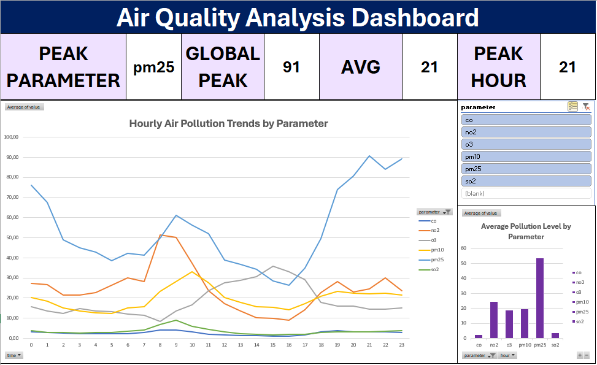

# 🌫️ Air Quality Analysis Dashboard (Excel)

## 📌 Overview

This project presents an interactive dashboard built using Microsoft Excel to analyze air quality data and identify pollution patterns.

## 🎯 Objectives

* Analyze hourly air pollution trends
* Identify peak pollution levels and peak hours
* Compare pollutant contributions (PM2.5, PM10, NO2, CO, etc.)

## 🛠️ Tools Used

* Microsoft Excel (Pivot Table, Slicers, Charts)

## 📊 Key Features

* Dynamic KPIs: Global Peak, Average, Peak Hour, Peak Parameter
* Interactive filtering using slicers
* Multi-parameter comparison in a single dashboard

## 🔍 Key Insights

* Peak pollution occurs at hour 21
* PM2.5 is the dominant pollutant with highest variability
* Air pollution shows a clear daily pattern (lower mid-day, higher evening)

## 🖼️ Dashboard Preview

## 🚀 What I Learned
- Data cleaning and preparation in Excel  
- Building interactive dashboards using Pivot Tables and Slicers  
- Identifying key insights from real-world datasets

## 📂 Dataset
This dataset is sourced from OpenAQ via Udacity and contains hourly air quality measurements.

---

✨ This is my first data analysis project using Excel.
